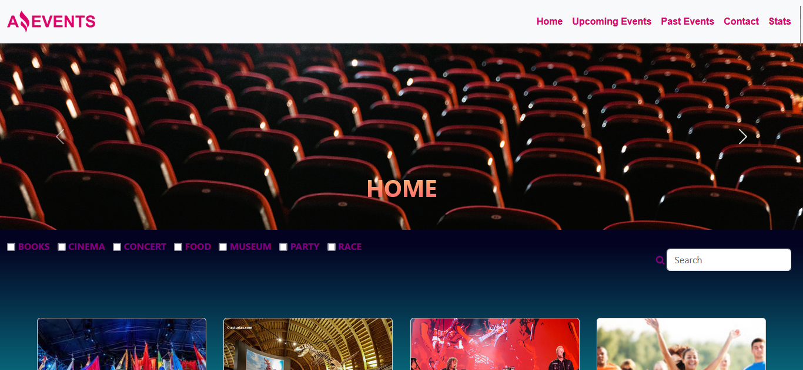
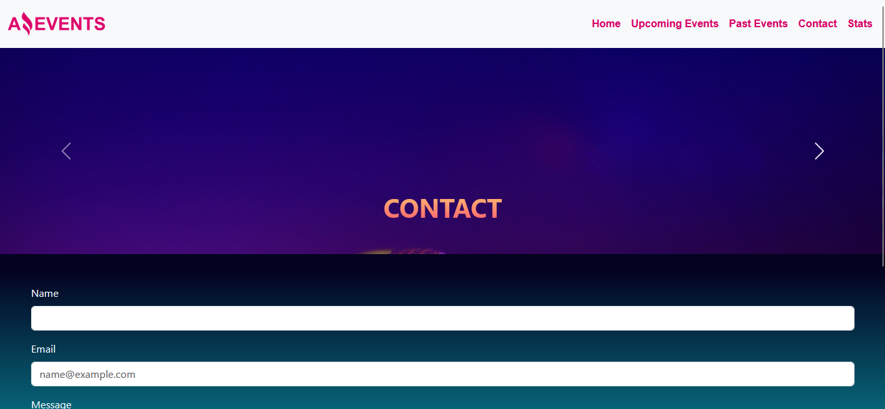
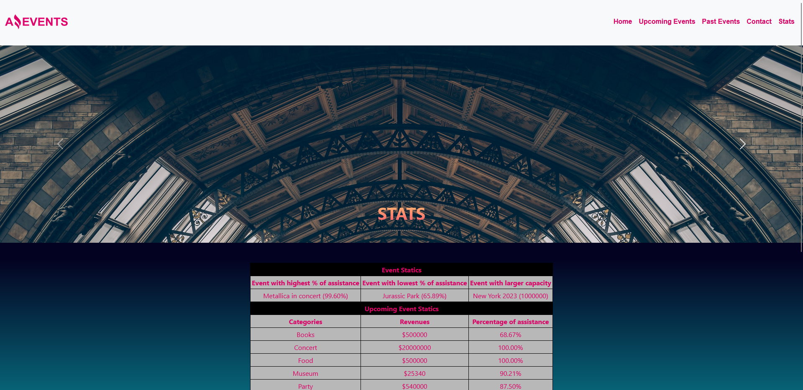

# AmazingEventsAndermatten

# AmazingEvents

Este repositorio contiene un sistema de gestión de eventos que te permite ver eventos pasados y futuros, posee un formulario de contacto, y te permite acceder a estadísticas relacionadas con los eventos. Además, puedes obtener detalles específicos de cada evento.

### Past Events

En la pestaña "Past Events", encontrarás una lista de eventos que ya han finalizado, junto con sus detalles.

### Upcoming Events

La sección "Upcoming Events" muestra los eventos que están programados para el futuro. Puedes consultar los detalles de los eventos que aún no han tenido lugar.

### Contact

La pestaña "Contact" te permite ponerte en contacto con los organizadores de los eventos a través de un formulario de contacto. Si deseas hacer alguna pregunta o dejar un mensaje, esta es la opción.

### Stats

En la sección "Stats", podrás acceder a estadísticas relacionadas con los eventos.

### Details

La pagina "Details", el cual podras acceder mediante la opcion 'Ver Mas' que poseen las tarjetas y puedes visualizar los eventos junto con sus detalles clave, que incluyen:

- **Nombre del Evento**
- **Fecha**
- **Descripción**
- **Categoría**
- **Lugar**
- **Capacidad**
- **Asistencia Actual**
- **Precio**

---
